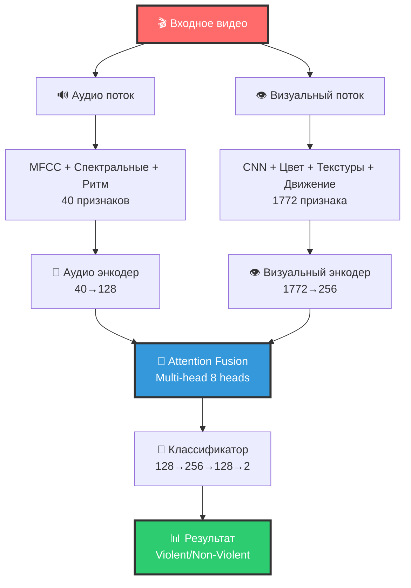
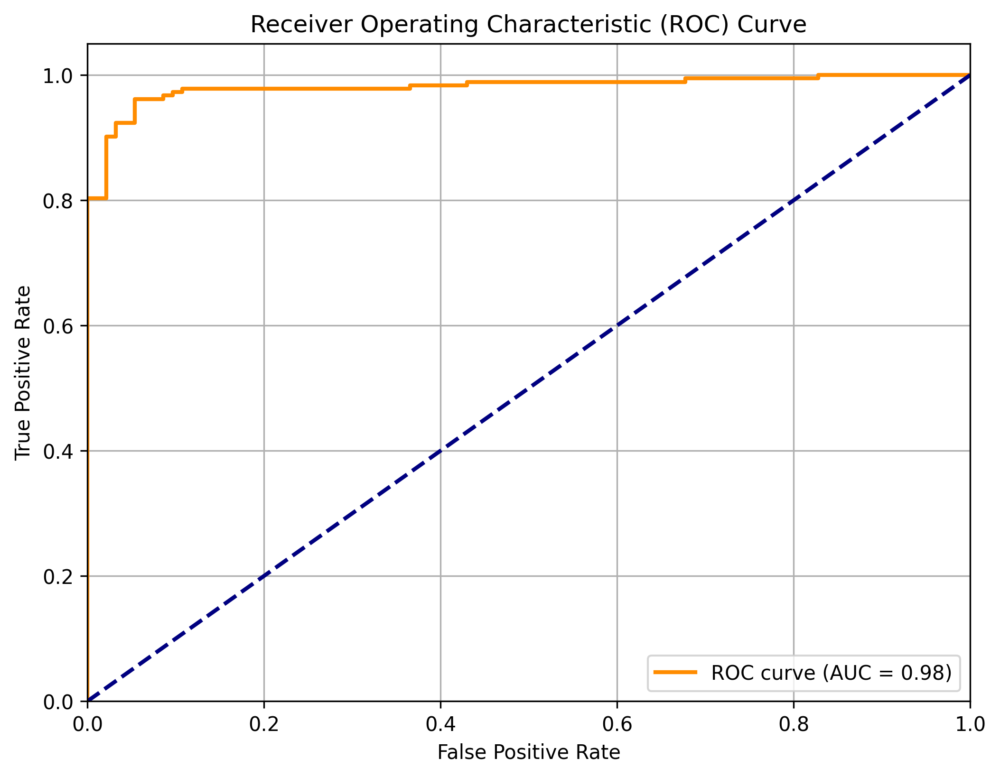
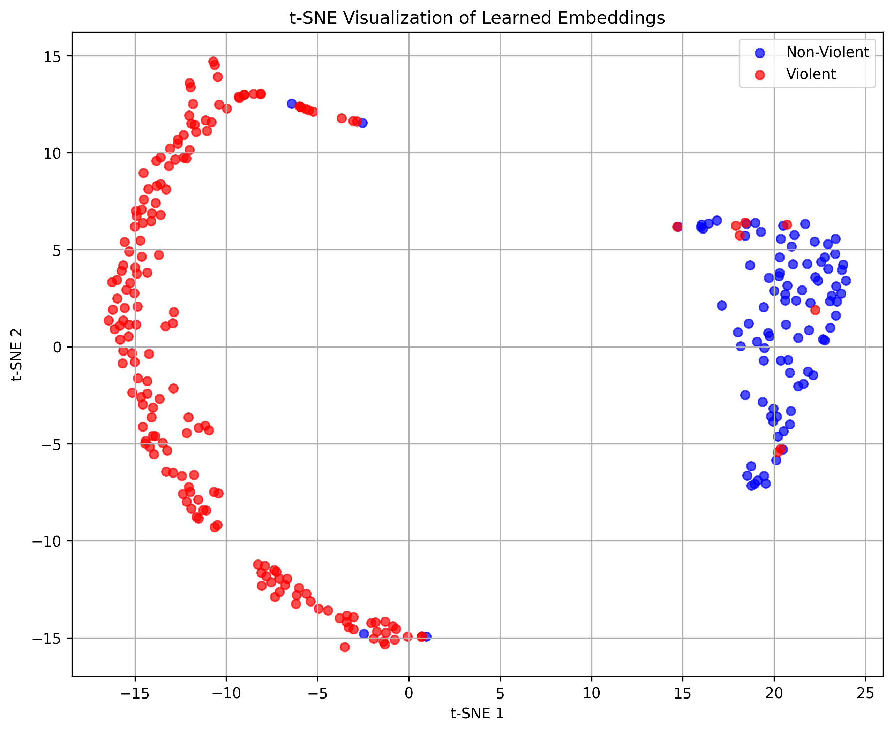
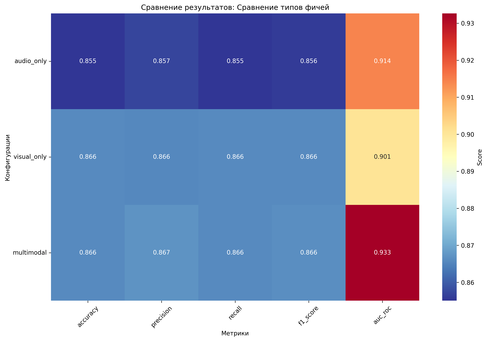
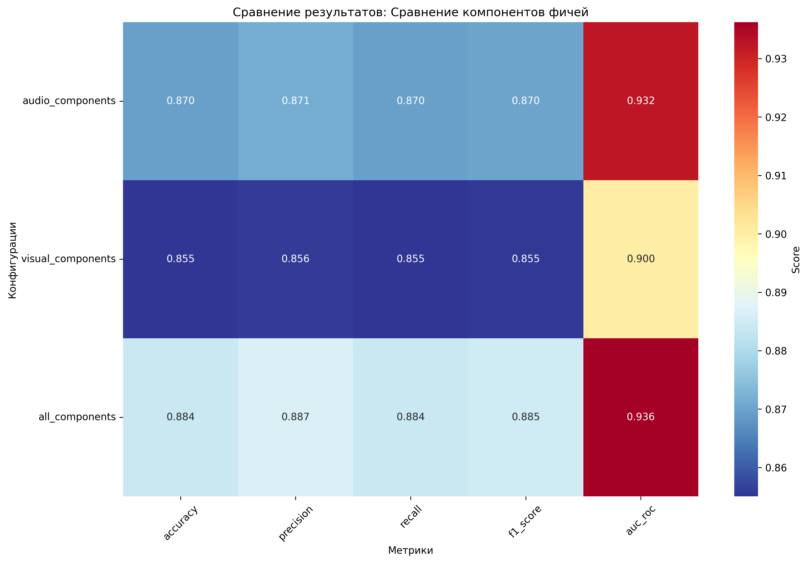

# 🎬 Мультимодальная система детекции насилия в видео

<div align="center">


**Интеллектуальная система для автоматической классификации видео на наличие насилия с использованием комбинации аудио и визуальных признаков**

</div>

## 🎯 Обзор проекта

Система детекции насилия в видео представляет собой мультимодальную нейронную сеть, которая анализирует как аудио, так и визуальные компоненты видео для определения наличия насильственного контента. Проект использует современные методы машинного обучения и компьютерного зрения для достижения высокой точности классификации.

### ✨ Ключевые особенности

- **🎵 Аудио анализ**: MFCC коэффициенты, спектральные характеристики, ритмические признаки
- **👁️ Визуальный анализ**: CNN признаки, цветовые характеристики, текстуры, движение
- **🧠 Мультимодальное слияние**: Attention mechanism для эффективного объединения модальностей
- **🔍 Режим сравнения фичей**: Автоматическое тестирование различных конфигураций
- **📊 Автоматические heatmap**: Визуализация результатов сравнения
- **⚡ Оптимизация**: Быстрая обработка с сохранением качества
- **🌐 Веб-интерфейс**: Gradio для удобного тестирования

---

## 🏗️ Архитектура системы

<div align="center">



</div>

### 🏛️ Детальная архитектура

<table>
<tr>
<th>Компонент</th>
<th>Вход</th>
<th>Выход</th>
<th>Параметры</th>
</tr>
<tr>
<td><strong>🎵 Аудио энкодер</strong></td>
<td>40 признаков</td>
<td>128 признаков</td>
<td>3 слоя: [512, 256, 128]<br/>LayerNorm + ReLU + Dropout(0.3)</td>
</tr>
<tr>
<td><strong>👁️ Визуальный энкодер</strong></td>
<td>1772 признака</td>
<td>256 признаков</td>
<td>3 слоя: [1024, 512, 256]<br/>LayerNorm + ReLU + Dropout(0.3)</td>
</tr>
<tr>
<td><strong>🧠 Attention Fusion</strong></td>
<td>128 + 256</td>
<td>128 признаков</td>
<td>Multi-head Attention (8 heads)<br/>Linear проекции + LayerNorm</td>
</tr>
<tr>
<td><strong>🎯 Классификатор</strong></td>
<td>128 признаков</td>
<td>2 класса</td>
<td>2 слоя: [256, 128] + выход<br/>LayerNorm + ReLU + Dropout(0.5)</td>
</tr>
</table>

---

## 🔍 Извлечение признаков

### 🎵 Аудио признаки (40 измерений)

| Тип признаков | Компоненты | Размерность | Описание |
|---------------|------------|-------------|----------|
| **MFCC** | 13 коэффициентов × 2 статистики | 26 | Mel-частотные кепстральные коэффициенты |
| **Спектральные** | 6 характеристик × 2 статистики | 12 | Спектральный центроид, полоса пропускания, контрастность |
| **Ритмические** | Tempo + Beat tracking | 2 | Темп и ритмические паттерны |

### 👁️ Визуальные признаки (1772 измерения)

| Тип признаков | Компоненты | Размерность | Описание |
|---------------|------------|-------------|----------|
| **CNN признаки** | MobileNet-V3 (576 × 3 статистики) | 1728 | Глубокие визуальные характеристики |
| **Цветовые** | RGB + гистограмма яркости | 38 | Цветовая информация |
| **Текстуры** | Градиенты Sobel | 3 | Текстурные характеристики |
| **Движение** | Разность кадров | 3 | Динамические изменения |

---

## 📊 Результаты и метрики

### 🎯 Основные метрики качества

<div align="center">

| Метрика | Значение |
|---------|----------|
| **Accuracy** | **86.2%** |
| **Precision** | **86.2%** | 
| **Recall** | **86.2%** |
| **F1-Score** | **86.2%** |
| **AUC-ROC** | **0.922** | 

</div>

### 📈 Визуализация результатов

<div align="center">





</div>

### 📊 Анализ по классам

| Класс | Precision | Recall | F1-Score | Support |
|-------|-----------|--------|----------|---------|
| **Non-Violent** | 80.2% | 78.5% | 79.3% | 93 |
| **Violent** | 89.2% | 90.2% | 89.7% | 183 |

### 🔍 Результаты сравнения фичей

| Конфигурация | Accuracy | F1-Score | AUC-ROC |
|--------------|----------|----------|---------|
| **🎯 Все компоненты** | **87.32%** | **87.50%** | **92.63%** |
| Только аудио | 80.43% | 80.97% | 89.83% | 
| Только видео | 81.52% | 81.79% | 88.61% | 

**Вывод**: Полная конфигурация (все компоненты) показывает наилучшие результаты, подтверждая важность использования всех доступных признаков для максимальной точности.

---

## 🚀 Быстрый старт

### 📋 Требования

```bash
# Python 3.8+
# PyTorch 1.9+
# CUDA (опционально, для GPU ускорения)
```

### 🔧 Установка

```bash
# Клонирование репозитория
git clone <repository-url>
cd lab_1

# Установка зависимостей
pip install -r Violence_Detection/requirements.txt
```

### ⚡ Быстрый запуск

```bash
# Полный пайплайн (извлечение + обучение + тестирование)
cd Violence_Detection
python main_pipeline.py

# 🔍 Режим сравнения фичей 
python main_pipeline.py --features-comp

# Классификация одного видео
python test.py path/to/video.mp4

# Веб-интерфейс
python gradio_app.py
```

---

## 💻 Использование

### 🎬 Классификация видео

```python
from Violence_Detection.test import VideoViolenceClassifier

# Инициализация
classifier = VideoViolenceClassifier(
    model_path="Violence_Detection/models/best_model.pth",
    scaler_audio_path="Violence_Detection/models/scaler_audio.pkl",
    scaler_visual_path="Violence_Detection/models/scaler_visual.pkl"
)

# Анализ видео
result = classifier.classify_video("sample_video.mp4")
print(f"Результат: {result['prediction']}")
print(f"Вероятность: {result['probability']:.2%}")
```

### 🌐 Веб-интерфейс

```bash
python Violence_Detection/gradio_app.py
```

Откроется интерфейс по адресу: `http://localhost:7860`

### 🔍 Режим сравнения фичей

```bash
# Базовое использование
python main_pipeline.py --features-comp

# С параметрами
python main_pipeline.py --features-comp --epochs 20 --batch-size 16

# Быстрый тест
python main_pipeline.py --features-comp --epochs 5 --batch-size 8
```

**Результаты:**
- 📊 Heatmap визуализации в `comparison_results/`
- 🏆 Лучшая модель в `best_models/`
- 📈 Автоматический выбор оптимальной конфигурации


---

## 📈 Сравнение признаков

### 🔍 Анализ важности признаков

<div align="center">

#### Матрица ошибок


#### ROC кривая


#### t-SNE визуализация эмбеддингов


</div>
<div align="center">

##### Heatmap сравнения типов фичей


##### Heatmap сравнения компонентов


</div>


```

---

## 🛠️ Технические детали

### 🏗️ Архитектурные решения

1. **Мультимодальность**: Комбинация аудио и визуальных признаков
2. **Attention mechanism**: Эффективное слияние модальностей
3. **Layer Normalization**: Стабилизация обучения
4. **Dropout**: Регуляризация против переобучения
5. **Предобученные модели**: ImageNet для визуальных признаков

### ⚡ Оптимизации производительности

- **Батчевая обработка**: CNN признаки извлекаются батчами по 8 кадров
- **Уменьшение кадров**: с 30 до 20 кадров на видео
- **Сжатие разрешения**: кадры до 320×240
- **Упрощенные алгоритмы**: быстрые статистики вместо сложных LBP
- **MobileNet-V3**: эффективная архитектура вместо ResNet-50

### 📊 Обработка данных

- **Нормализация**: StandardScaler для всех признаков
- **Аугментация**: Временные сдвиги для аудио
- **Балансировка**: Стратифицированное разделение данных
- **Валидация**: 10% данных для валидации

### 🎓 Обучение модели

- **Оптимизатор**: Adam (lr=0.001)
- **Scheduler**: StepLR (step_size=10, gamma=0.5)
- **Loss**: CrossEntropyLoss
- **Batch size**: 32
- **Epochs**: 50 с early stopping

---

## 📁 Структура проекта

```
lab_1/
├── 📄 Violence_Detection/           # Основная директория проекта
│   ├── 🧠 Модели
│   │   ├── multimodal_model.py      # Архитектура мультимодальной модели
│   │   ├── train_model.py           # Обучение модели
│   │   └── test_model.py            # Тестирование модели
│   │
│   ├── 🔍 Извлечение признаков
│   │   ├── audio_features.py        # Аудио признаки
│   │   └── visual_features.py       # Визуальные признаки
│   │
│   ├── 🛠️ Утилиты
│   │   ├── main_pipeline.py         # Главный пайплайн
│   │   ├── test.py                  # Классификация видео
│   │   └── gradio_app.py            # Веб-интерфейс
│   │
│   ├── 📊 Результаты
│   │   ├── models/                  # Обученные модели
│   │   ├── test_results/            # Результаты тестирования
│   │   ├── audio_features/          # Аудио признаки
│   │   └── visual_features/         # Визуальные признаки
│   │
│   └── 📚 Документация
│       ├── README.md                # Документация проекта
│       ├── INSTALL.md               # Инструкции по установке
│       └── requirements.txt         # Зависимости
│
└── 📄 README.md                     # Этот файл
```

[](https://github.com)
[](https://pytorch.org)
[](https://python.org)

</div>
